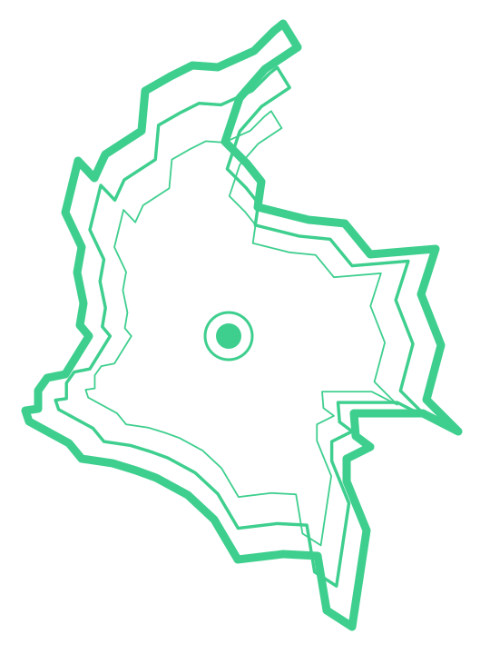
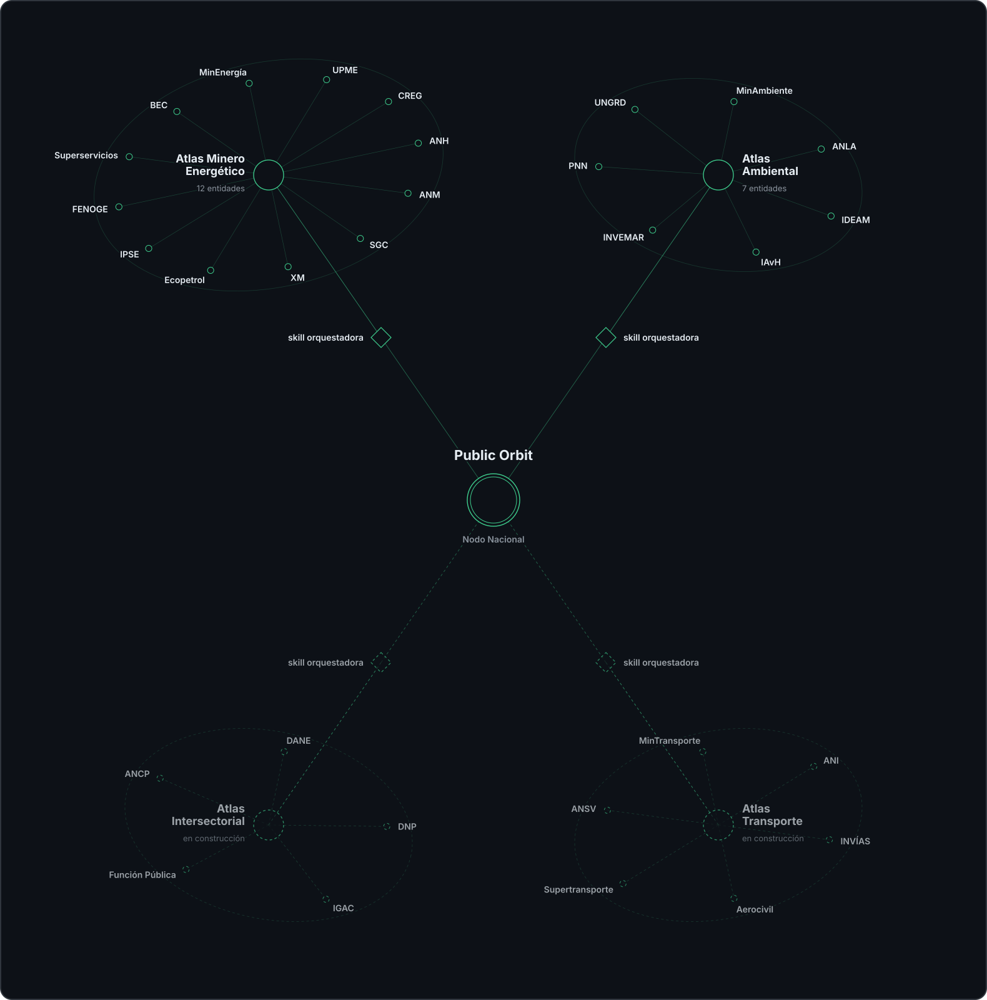

<div align="center">
  
  <h1>Public Orbit</h1>
  <p><em> Una infraestructura común para descubrir, conectar y navegar la información pública de Colombia.</em></p>
 <table
    <tr>
      <td align="center" width="180">
        <a href="atlas/minero-energetico/">
          <br>
          <strong>Atlas de Navegación<br>Minero Energético<br>de Colombia</strong>
        </a>
      </td>
      <td align="center" width="180">
        <a href="atlas/ambiental/">
          <br>
          <strong>Atlas de Navegación<br>Ambiental<br>de Colombia</strong>
        </a>
      </td>
    </tr>
  </table>
</div>

---

Public Orbit es un proyecto abierto que organiza y hace reutilizable el conocimiento necesario para recorrer los ecosistemas digitales de las instituciones públicas. Su unidad básica es la **skill**, una estructura que documenta las rutas, fuentes y recursos de información de cada entidad.

Las skills relacionadas se agrupan en **Atlas de Navegación**. Cada Atlas articula las entidades de un ámbito y puede funcionar de manera independiente. En conjunto, los Atlas forman un sistema modular conectado por un estándar común y por un **Nodo Nacional**, que permite reconocer relaciones y coordinar recorridos entre sectores.

La información pública está distribuida entre portales, micrositios, sistemas de información, geovisores, publicaciones y bases de datos. El desafío también está en saber dónde buscar, qué fuente utilizar, cómo interpretarla y con qué otras fuentes relacionarla. Public Orbit convierte ese conocimiento práctico en una infraestructura abierta, documentada y utilizable por agentes de IA como Claude Code, Codex y OpenCode.

Al hacer explícito y compartible este conocimiento de navegación, Public Orbit busca ampliar la autonomía de quienes consultan información pública, ofreciendo puntos de entrada, criterios y recorridos que permitan formular mejores preguntas, contrastar fuentes y comprender cómo se organiza digitalmente el conocimiento de cada sector.

## Cómo funciona

Un Atlas de Navegación reúne e integra skills que documentan cómo encontrar, comprender y usar la información pública de un sector. Cada entidad cuenta con una skill que describe sus rutas y fuentes de información, mientras una skill orquestadora organiza los recorridos que involucran a varias entidades del mismo ámbito.

Public Orbit articula estos atlas mediante un estándar compartido, un registro de los atlas existentes y las entidades que cubren, y un Nodo Nacional (la skill de orquestación [`atlas-orquestador-colombia`](atlas/nacional/skills/atlas-orquestador-colombia/SKILL.md)) que conecta sus ámbitos y coordina recorridos entre sectores.

Cada skill por entidad se compone de tres archivos complementarios: `SKILL.md` describe la entidad y orienta la navegación; `mapa-web.md` representa como un árbol curado la estructura de su sitio oficial; y `fuentes.md` reúne los sistemas, geovisores, portales, publicaciones y documentos clave. Las skills orquestadoras contienen solo un `SKILL.md`: no duplican esa información, sino que conectan las skills de entidad y dirigen hacia ellas según la consulta.

El Nodo Nacional incorpora una capa de articulación entre atlas. Hace explícitas las conexiones entre sectores, reconoce dónde vive cada parte de un asunto y permite recorrer de forma conjunta información distribuida entre distintas entidades y competencias.

Estas conexiones pertenecen a la arquitectura de Public Orbit antes de que una consulta las active. Una pregunta permite recorrerlas, pero no las crea ni delimita su alcance. Ante una necesidad concreta, el nodo reconoce los ámbitos involucrados, localiza la información, conecta los tramos y coordina su recorrido mediante las orquestadoras sectoriales. Cómo se construye cada skill está definido en la [especificación](estandar/especificacion.md).

Cada atlas puede instalarse y funcionar por separado sin perder capacidad sectorial. La información específica permanece en la skill de cada entidad y, cuando una consulta supera ese ámbito, el atlas no sustituye el conocimiento de otros sectores: señala hacia dónde debe continuar el recorrido.

## Atlas registrados

| Atlas | Sector | Entidades | Repositorio |
| --- | --- | --- | --- |
| Atlas de Navegación Minero Energético de Colombia | Minero energético | 12 | [`atlas/minero-energetico/`](atlas/minero-energetico/) |
| Atlas de Navegación Ambiental de Colombia | Ambiental | 7 | [`atlas/ambiental/`](atlas/ambiental/) |



El trazo discontinuo marca los atlas en construcción: el Intersectorial y el de Transporte tienen sus entidades definidas, pero todavía no sus skills ni su orquestadora, así que aún no se registran arriba.

El detalle de entidades vive en [`registro.md`](registro.md).

## Sitio web

Public Orbit puede explorarse en su [sitio web provisional](https://sistema-atlas-colombia.nicolasmcfc.workers.dev), que reúne los atlas, las entidades, las skills y la documentación del proyecto.

El sitio también presenta las [morfologías web](https://sistema-atlas-colombia.nicolasmcfc.workers.dev/morfologias), representaciones visuales construidas a partir del `mapa-web.md` de cada entidad.

## Qué contiene este repositorio

```text
public-orbit/
├── registro.md       → Atlas existentes y entidades de cada uno
├── instalar.ps1 / instalar.sh       → Instaladores de skills (interfaces equivalentes)
├── estandar/
│   ├── especificacion.md            → El estándar de los atlas (versionado)
│   └── templates/                   → Plantillas para construir nuevas skills
├── atlas/
│   ├── nacional/         → Nodo nacional: articula los atlas y coordina recorridos interatlas
│   ├── ambiental/        → Atlas ambiental: README propio + skills/ + examples/
│   ├── minero-energetico/ → Atlas minero energético: README propio + skills/ + examples/
│   ├── intersectorial/   → Entidades transversales (DANE, DNP, …) — en construcción
│   └── transporte/       → Sector transporte (MinTransporte, ANI, INVÍAS, …) — en construcción
└── examples/
    └── consultas-de-ejemplo.md      → Consultas que cruzan atlas, con su ruta esperada
```

## Instalación

Instala uno, varios o todos los atlas con un solo comando. Cada atlas funciona completo por sí solo; al instalar dos o más, se agrega automáticamente `atlas-orquestador-colombia`, la skill que articula los atlas instalados, identifica conexiones entre sus ámbitos y coordina recorridos y consultas interatlas.

### Instalación con script

Clona el monorepo junto a tu proyecto:

```bash
git clone https://github.com/Nicolas9714/public-orbit.git
```

Un solo comando ejecutado desde la raíz de tu proyecto instala los atlas que pidas, y, si son dos o más, agrega automáticamente la orquestadora nacional:

> El repo clonado y la copia en tu proyecto cumplen roles distintos: el clon es la fuente, que actualizas con `git pull` (o con `-Actualizar` / `--actualizar` al instalar); la copia en tu carpeta de skills es la instalación, que tu proyecto controla y que solo cambia cuando decides reinstalar.
>
> Al reinstalar, cada skill solicitada se reemplaza de forma exacta para retirar archivos obsoletos. Conserva tus personalizaciones fuera de las carpetas instaladas o respáldalas antes de ejecutar nuevamente el instalador.

```powershell
# Windows (PowerShell)
..\public-orbit\instalar.ps1 -Atlas todos
```

```bash
# macOS / Linux / Git Bash
bash ../public-orbit/instalar.sh --atlas todos
```

**Opciones** (PowerShell / bash):

| Qué hace | PowerShell | Bash |
| --- | --- | --- |
| Elige atlas específicos | `-Atlas ambiental,minero-energetico` | `--atlas ambiental,minero-energetico` |
| Instala una sola skill por entidad | `-Entidad navegar-anla` | `--entidad navegar-anla` |
| Instala para Codex en vez de Claude Code | `-Destino .agents\skills` | `--destino .agents/skills` |
| Instala en tu carpeta de usuario (global) | `-Global` | `--global` |
| Hace `git pull` del monorepo antes de copiar | `-Actualizar` | `--actualizar` |

`-Entidad` / `--entidad` solo se puede usar con un único atlas en `-Atlas`.

Los pasos siguientes muestran la instalación manual equivalente.

### Instalación manual

Copia las skills de cada atlas desde su subcarpeta del monorepo a la carpeta de skills de tu herramienta. Para el atlas ambiental en Claude Code:

macOS / Linux / Git Bash:

```bash
cp -r ../public-orbit/atlas/ambiental/skills/* .claude/skills/
```

Windows (PowerShell):

```powershell
Copy-Item -Recurse -Force `
  "..\public-orbit\atlas\ambiental\skills\*" `
  ".claude\skills\"
```

Cambia `ambiental` por `minero-energetico` para el otro atlas, y `.claude\skills` por `.agents\skills` (Codex) u `.opencode\skills` (OpenCode) según tu herramienta. Si ya tienes skills en `.claude/skills/`, OpenCode también las lee, sin necesidad de duplicar.

Si instalas dos o más atlas, agrega también la orquestadora nacional desde `atlas/nacional/`:

```bash
cp -r ../public-orbit/atlas/nacional/skills/atlas-orquestador-colombia .claude/skills/
```

Para instalación global, usa la carpeta del usuario en vez del proyecto (`~/.claude/skills/`, `~/.agents/skills/`, `~/.opencode/skills/`; en Windows `~` corresponde a `$env:USERPROFILE`).

> **Claude.ai / ChatGPT (no recomendada):** solo como referencia — Claude.ai: *Personalizar* → *Skills* → *Añadir* → *Cargar una habilidad*; ChatGPT: *Complementos* → *Habilidades* → *Subir desde tu ordenador* (si no reconoce la skill en el chat normal, cambia a modo *Work*).

### Ejemplo: consulta en lenguaje natural

Las consultas son una de las formas de activar las conexiones interatlas. Cuando una pregunta cruza sectores, el Nodo Nacional identifica qué parte corresponde a cada atlas y coordina el orden del recorrido:

> - «¿Qué títulos y solicitudes mineras existen en el suroeste de Antioquia, qué potencial geológico tiene la zona y qué restricciones ambientales la limitan?»
> - «¿Qué proyectos de hidrocarburos con licencia activa operan en el Magdalena Medio, qué obligaciones ambientales tienen y qué muestra el monitoreo de sus cuencas?»
> - «¿Cuánta capacidad solar y eólica entró en operación frente a la meta 6GW, qué proyectos siguen en licenciamiento y cuánto generan los que ya operan?»

Las rutas esperadas de estas consultas viven en [`examples/consultas-de-ejemplo.md`](examples/consultas-de-ejemplo.md).

## Para quién

- investigadores y estudiantes que cruzan sectores en un mismo análisis
- analistas y consultores de proyectos con componentes técnicos
- funcionarios públicos que coordinan información entre entidades
- equipos y personas que quieran construir un atlas nuevo sobre el estándar

## Cómo crear un atlas nuevo

1. Lee [`estandar/especificacion.md`](estandar/especificacion.md) — distingue lo obligatorio (N1–N5) de lo recomendado. Un atlas es compatible cumpliendo solo lo obligatorio.
2. Usa las plantillas de [`estandar/templates/`](estandar/templates/) para las skills de entidad, y los dos atlas registrados como referencia de buenas prácticas.
3. Comprueba la conformidad con `bash verificar-conformidad.sh <alias>` antes de proponer nada. Ver [Cómo se comprueba la conformidad](#cómo-se-comprueba-la-conformidad).
4. Cuando el atlas esté publicado, propón su registro con un pull request a [`registro.md`](registro.md), declarando la versión del estándar que cumple y agregando su tarjeta al banner de este README.

Public Orbit parte de un hecho: la información pública se organiza según las competencias de las instituciones que la producen, mientras los asuntos reales suelen atravesar varias. Cada atlas nuevo amplía los ámbitos, rutas y conexiones que Public Orbit puede reconocer y recorrer.

El estándar aplica a cualquier sector (agro, salud, transporte) y a cualquier país: un nodo nacional de otro país puede usar esta misma estructura y los sistemas nacionales que comparten el estándar formarían, entre sí, una red.

## Cómo se comprueba la conformidad

El estándar trae su propia implementación de referencia: [`verificar-conformidad.sh`](verificar-conformidad.sh), que revisa la parte normativa (N1–N5 y autocontención) sin tocar la recomendada.

```bash
bash verificar-conformidad.sh            # todos los atlas
bash verificar-conformidad.sh ambiental  # uno solo
```

Sale con código 0 cuando no hay fallas y 1 cuando algún atlas incumple. Cada atlas se examina como si fuera la raíz de su propio repositorio, sin asumir nada del resto del árbol, de modo que el mismo chequeo vale para un atlas suelto y para uno alojado en `atlas/<sector>/`.

Hay tres modos de evaluación:

| Estado del atlas | Qué se le exige | Resultado |
|---|---|---|
| Sectorial poblado | N1–N5 y autocontención | conforme / no conforme |
| Nodo nacional | Solo su orquestadora (N1 y N2 no aplican) | conforme / no conforme |
| En construcción | Carpetas marcador bien nombradas y vacías | omitido |

Un atlas cuenta como «en construcción» cuando figura en la lista `EN_CONSTRUCCION` del script. La lista es explícita a propósito, para que un atlas que se despueble por error falle en vez de pasar por pendiente. Al crear un atlas nuevo hay que añadirlo ahí y a la nota de [`registro.md`](registro.md), y retirarlo de ambas cuando quede poblado.

[`tests/probar-verificar-conformidad.sh`](tests/probar-verificar-conformidad.sh) acompaña al verificador con pruebas adversariales: sabotean el repositorio sobre una copia temporal (nombres divergentes, enlaces entre atlas, skills vaciadas, entidades a medio poblar) y exigen que el verificador lo detecte. Sin ellas, un verificador que aprobara todo también saldría en verde.

[`.github/workflows/conformidad.yml`](.github/workflows/conformidad.yml) corre ambos en cada push y cada pull request a `main`.

## Contribuir

Ver [CONTRIBUTING.md](CONTRIBUTING.md): cómo registrar un atlas, proponer cambios al estándar o mejorar el enrutamiento entre atlas.

## Licencia

Ver [LICENSE](LICENSE).
